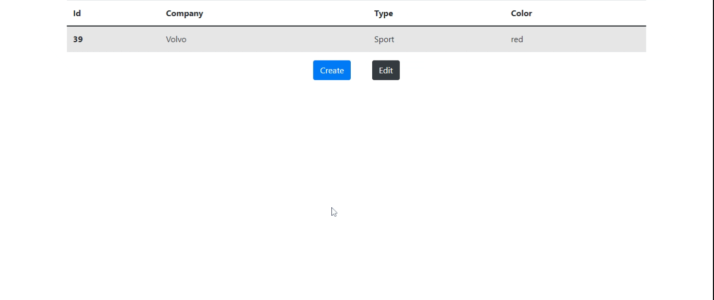

<!-- PROJECT LOGO -->
 

  <h3 align="center">Smarti Test - Cars</h3>
  

  A cars CRUD project made with Angular and Laravel - To active them see the server and client doc (remember you need two terminals).
     
     
     
    <a href="https://gold-rush.netlify.app/">Go To Server Documentation</a>
    ·
    <a href="https://github.com/tomeraitz/gold-rush-server/issues">Go To Client Documentation</a>
  

